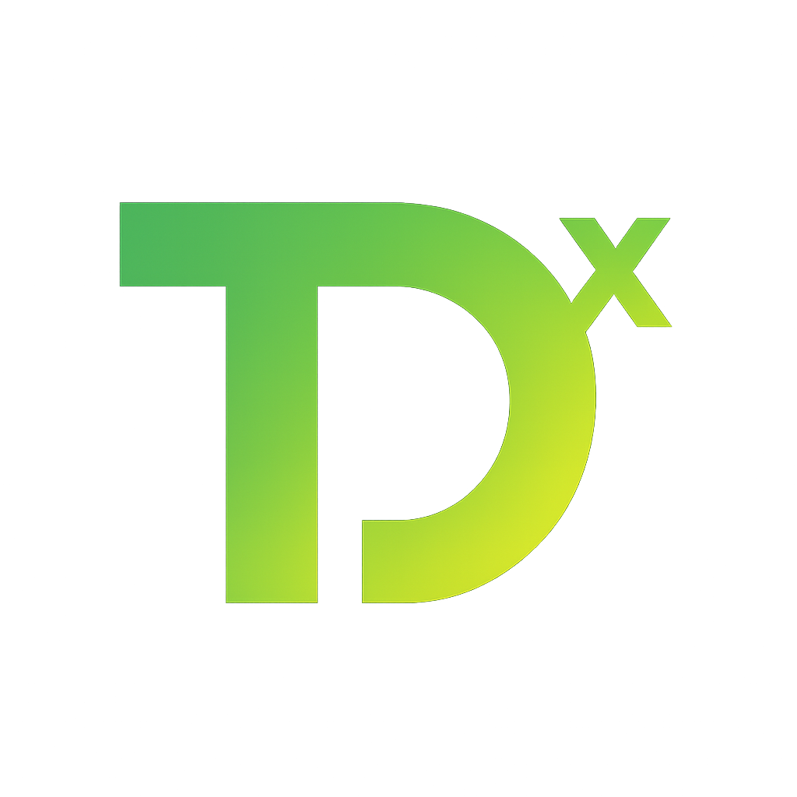

# TaylorDx Docker Dashboard



A comprehensive monitoring and management dashboard for Docker services and media server applications like Radarr, Sonarr, Plex, and more.

## 🌟 Features

- **Service Monitoring**: Real-time monitoring of Docker services and applications
- **Extended Analytics**: Detailed performance metrics, storage usage, and health monitoring
- **Docker Integration**: Full Docker container management and monitoring
- **Unraid Support**: Native integration with Unraid servers
- **Network Discovery**: Automatic discovery and addition of network services
- **Modern UI**: Beautiful, responsive interface with dark theme
- **Real-time Updates**: Live stats and notifications

## 🚀 Quick Start

### Prerequisites

- Docker and Docker Compose
- At least 2GB RAM available
- Network access to services you want to monitor

### Installation

1. **Clone the repository:**
```bash
git clone <repository-url>
cd docker-dashboard
```

2. **Start the application:**
```bash
docker-compose up -d
```

3. **Access the dashboard:**
- Open http://localhost:3000 in your browser
- Backend API available at http://localhost:5000

## 📖 Documentation

### Quick Links
- [Installation Guide](docs/INSTALLATION.md) - Detailed setup instructions
- [Configuration Guide](docs/CONFIGURATION.md) - Service configuration
- [API Documentation](docs/API_DOCUMENTATION.md) - Backend API reference
- [Troubleshooting](docs/TROUBLESHOOTING.md) - Common issues and solutions
- [Contributing](CONTRIBUTING.md) - Development guidelines

### Architecture
- [Technical Architecture](docs/architecture.md) - System design overview
- [Development Workflow](docs/DEVELOPMENT_WORKFLOW.md) - Development process
- [Design System](docs/DESIGN_SYSTEM.md) - UI/UX guidelines

## 🔧 Supported Services

### Media Management
- **Radarr** - Movie collection management
- **Sonarr** - TV series collection management
- **Lidarr** - Music collection management
- **Prowlarr** - Indexer management

### Media Servers
- **Plex** - Media streaming server
- **Unraid** - Storage and virtualization platform

### Docker Management
- **Docker Hosts** - Direct Docker API integration
- **Container Control** - Start, stop, restart containers
- **Resource Monitoring** - CPU, memory, storage usage

## 🏗️ Architecture

```
┌─────────────────┐    ┌─────────────────┐    ┌─────────────────┐
│   Frontend      │    │    Backend      │    │   Services      │
│   (React)       │◄──►│   (Node.js)     │◄──►│   (APIs)        │
│   Port 3000     │    │   Port 5000     │    │   Various       │
└─────────────────┘    └─────────────────┘    └─────────────────┘
                              │
                       ┌─────────────────┐
                       │   Database      │
                       │ (PostgreSQL)    │
                       │   Port 5432     │
                       └─────────────────┘
```

## 🎯 Key Features

### Service Monitoring
- Real-time health checks and status monitoring
- Performance metrics and resource usage
- Historical data tracking and analytics
- Custom alerting and notifications

### Docker Integration
- Container lifecycle management
- Resource monitoring and allocation
- Network and volume management
- Multi-host Docker support

### Enhanced Analytics
- Detailed service statistics
- Storage usage analytics
- Performance trend analysis
- Custom dashboards and widgets

### Network Discovery
- Automatic service detection
- Port scanning and identification
- Bulk service configuration
- Network topology mapping

## 🌐 Browser Support

- Chrome/Chromium (recommended)
- Firefox
- Safari
- Edge

## 📊 Screenshots


## 🤝 Contributing

We welcome contributions! Please see our [Contributing Guide](CONTRIBUTING.md) for details on:

- Setting up the development environment
- Code style and conventions
- Submitting pull requests
- Reporting issues

## 📝 License

This project is licensed under the MIT License - see the [LICENSE](LICENSE) file for details.

## 🙏 Acknowledgments

- Built with React, Node.js, and Docker
- Inspired by modern homelab management tools
- Thanks to the open-source community for excellent libraries and tools

## 📧 Support

- **Issues**: Please use GitHub Issues for bug reports and feature requests
- **Discussions**: Join our community discussions for general questions
- **Documentation**: Check our comprehensive docs for detailed guides

---

**TaylorDx** - Streamlining Docker service management for modern homelabs.